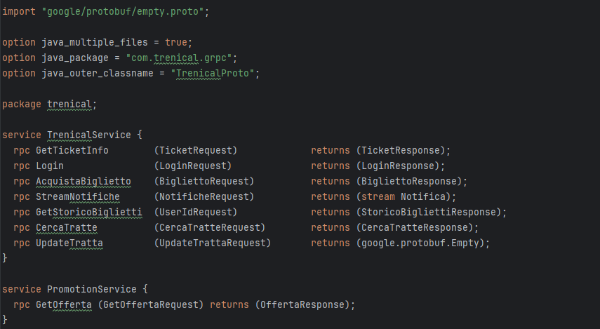
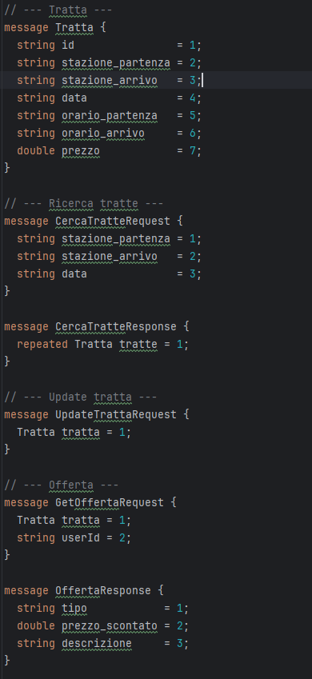
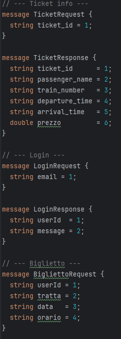
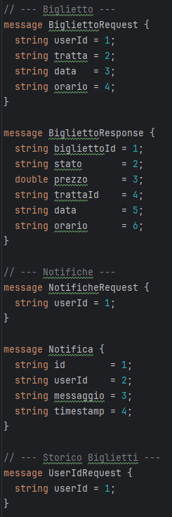
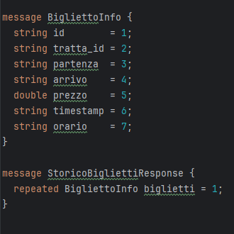

# 🚄 Trenical – Sistema Ferroviario Distribuito

**Trenical** è un’applicazione client-server in Java, sviluppata per il corso di *Ingegneria del Software* (a.a. 2024/2025), per la gestione di tratte ferroviarie, biglietti, promozioni personalizzate e notifiche in tempo reale. Comunica via **gRPC** e offre due GUI realizzate in **JavaFX**: una per l’utente e una per l’amministratore.

---

## ⚙️ Tecnologie utilizzate

- **Java 21**
- **JavaFX** (GUI Utente e GUI Admin)
- **gRPC** + Protocol Buffers
- **Maven**
- **Gson** (persistenza in JSON)
- **JUnit 5** (testing)

---

## 📁 Struttura del progetto
Progetto Trenical Lorenzo Fodaro/
├── client/ ← GUI JavaFX lato utente
├── server/ ← Server gRPC + GUI JavaFX lato admin
├── common/ ← File .proto + classi condivise
├── docs/
│ └── screenshot/ ← Screenshot protocolli e GUI
├── pom.xml ← POM principale (multi-modulo)
└── README.md ← Questo file 

---

## Modalità di utilizzo

### 1. Generazione classi gRPC

Apri un terminale nella root del progetto ed esegui:

mvn clean install

Compila tutti i moduli e genera le classi Java dai file .proto in common/.

## Avvio del server gRPC
server/src/main/java/com/trenical/server/GrpcServer.java

## Avvio del pannello amministratore
server/src/main/java/com/trenical/server/TrenicalAdminApp.java

## Avvio del client utente
client/src/main/java/com/trenical/client/ClientMain.java

## Lato Utente
Login e gestione sessione

Ricerca tratte disponibili

Applicazione automatica di promozioni:

Sconto Studente

Sconto Weekend

Sconto Last-Minute

Acquisto biglietti con prezzo scontato

Ricezione notifiche in tempo reale

## Lato Amministratore
Visualizzazione e modifica delle tratte

Ricerca utenti per email e attivazione/disattivazione fedeltà

Gestione notifiche server → client via stream gRPC

Interfaccia JavaFX con TableView, form di insert/update

## Screenshot

### File .proto iniziale

### Definizioni gRPC

